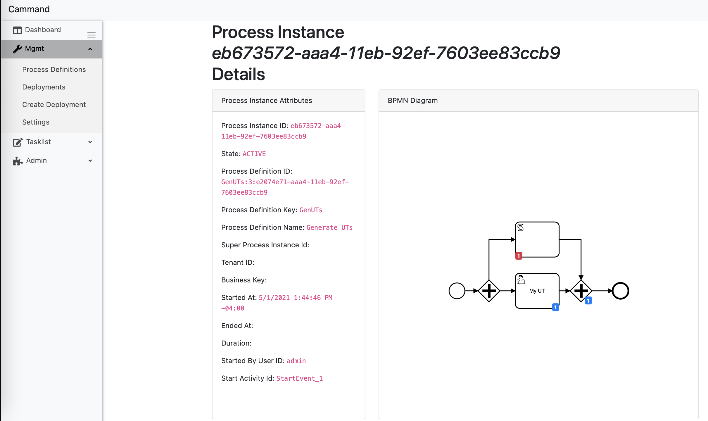
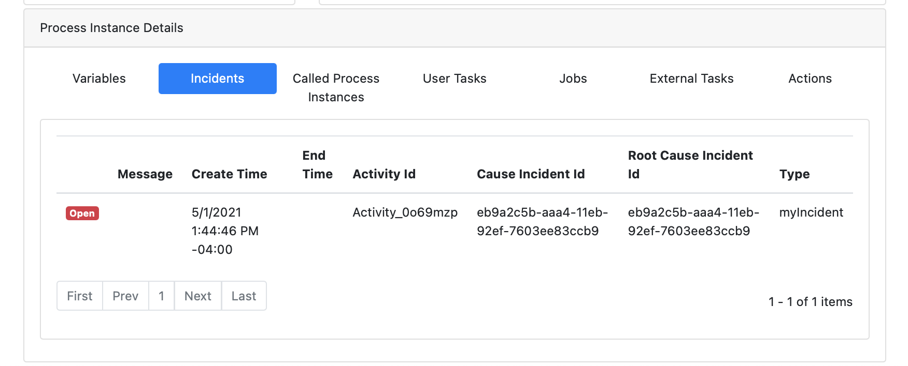
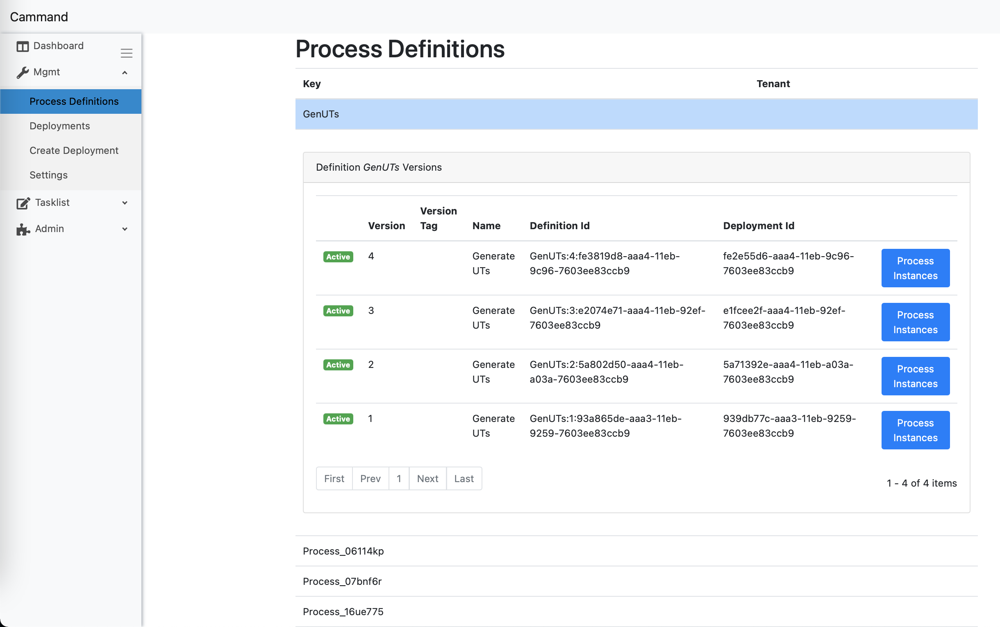
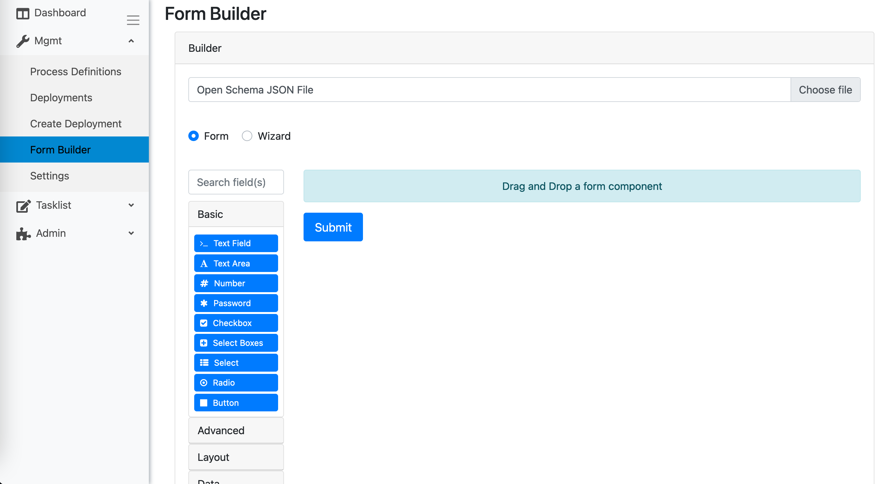
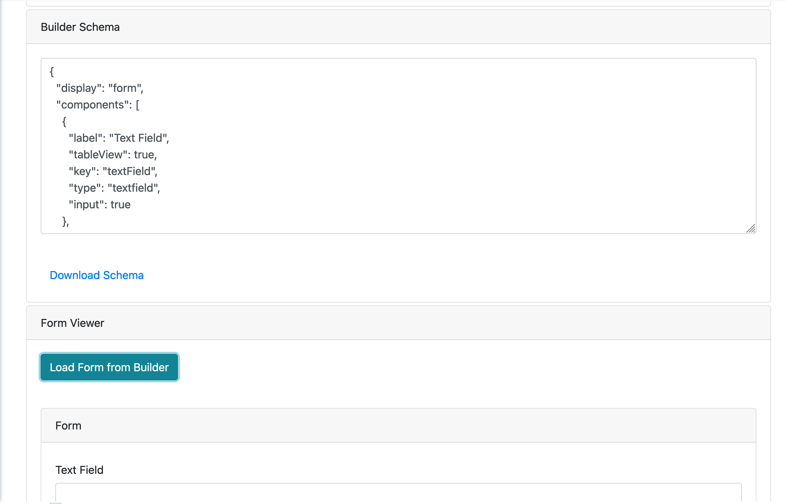
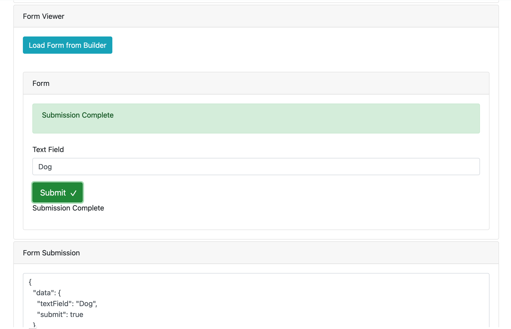

# Cammand

Alternative UI to Camunda BPM Webapps (Tasklist, Cockpit, and Admin) + More!

WIP.

Contributions and collaboration is always welcomed.


1. Extendable
2. Customizable
3. Enterprise Friendly
4. White-label Friendly
5. Theme-able
6. Runtime and History API access!
7. Swap APIs for your custom endpoints
8. What more do you need?









# Form Builder








# Quick Start

1. open terminal at `./src/MainApp`
1. run `dotnet run`
1. got to `localhost:5001`

Currently requires HTTPS on the Camunda API endpoint.


# Internals

1. Built with Microsoft Blazor Web Assembly.
1. Supports Form.io Form Rendering.
1. Supports BPMN.io rendering.
1. Supports Camunda API using Camunda's OpenAPI support.


# BPMN.io / bpmnjs Support:

Notice the ability to define custom Render Fragments (HTML) for overlays and other common modifications!

```xml
<Column>
                <Card>
                    <CardHeader>BPMN Diagram</CardHeader>
                    <CardBody Style="height: 700px">
                        <BpmnViewer bpmnXml="@bpmnXml"
                                    activityIncidentCounts="@activityIncidentCounts"
                                    activeActivityCounts="@activeActivityCounts"
                                    completedActivityInstanceCounts="@completedActivityInstanceCounts"
                                    applyCompletedActivityMarker="true"
                                    completedActivityMarkerConfig="highlight">
                            <activityIncidentCountDisplay>
                                <Badge Color="Color.Danger">@context</Badge>
                            </activityIncidentCountDisplay>
                            <activeActivityCountDisplay>
                                <Badge Color="Color.Primary">@context</Badge>
                            </activeActivityCountDisplay>
                            <completedActivityInstanceCountDisplay>
                                <Badge Color="Color.Success">@context</Badge>
                            </completedActivityInstanceCountDisplay>
                        </BpmnViewer>
                    </CardBody>
                </Card>
            </Column>
```


# Quick SpringBoot Configs for Camunda:

Development use only.

```kotlin
@Configuration
class CamundaConfig {

    @Bean
    fun processCorsFilter(): FilterRegistrationBean<*> {
        val source = UrlBasedCorsConfigurationSource()
        val config = CorsConfiguration()
        config.allowCredentials = true
        config.addAllowedOrigin("https://localhost:5001")
        config.addAllowedHeader("*")
        config.addAllowedMethod("*")
        source.registerCorsConfiguration("/**", config)

        val bean = FilterRegistrationBean(CorsFilter(source))
        bean.order = 0
        return bean
    }
}

@Configuration
class CamundaSecurityFilter {
    @Bean
    fun processEngineAuthenticationFilter(): FilterRegistrationBean<*> {
        val registration = FilterRegistrationBean<Filter>()
        registration.setName("camunda-auth")
        registration.filter = getProcessEngineAuthenticationFilter()
        registration.addInitParameter(
            "authentication-provider",
            "org.camunda.bpm.engine.rest.security.auth.impl.HttpBasicAuthenticationProvider"
        )
        registration.addUrlPatterns("/engine-rest/*")
        return registration
    }

    @Bean
    fun getProcessEngineAuthenticationFilter(): Filter {
        return ProcessEngineAuthenticationFilter()
    }
}
```

application.yml

```yml
server.ssl.key-store: classpath:keystore.p12
server.ssl.key-store-password: MYPASSWORD
server.ssl.key-store-type: PKCS12
server.ssl.key-alias: tomcat
```